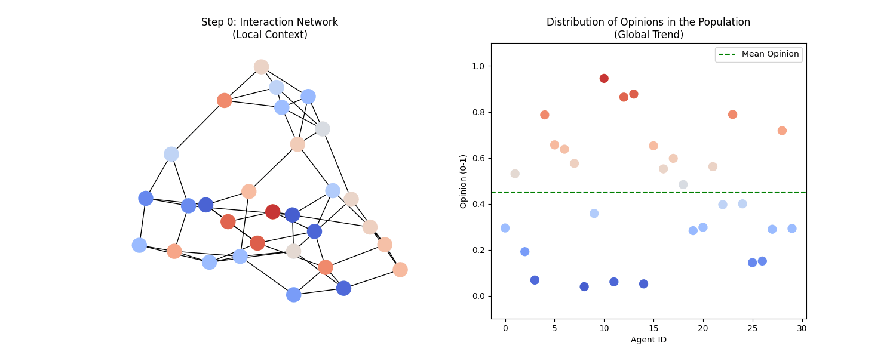

# Stochastic Opinion Dynamics

Simulations of opinion formation on social networks — a computer modelling course project.

## What's inside

| File | Description |
|------|-------------|
| `opinion_dynamics.ipynb` | Core models: convergence to the mean, two-agent dynamics, discrete opinion model, influencers on directed graphs, true belief vs declared opinion, crowd pressure vs pairwise interactions |
| `praca_praca.ipynb` | The four models run on a **real** social network: reproducing structural polarisation, sensitivity analysis of the confidence bound ε, assortativity tracking |
| `presentation.md` / `*.pptx` / `*.pdf` | Project presentations |
| `requirements.txt` | Python dependencies |

## Key ideas

- Agents hold continuous opinions in `[−1, 1]` and interact over a network (NetworkX).
- Bounded confidence: agents only influence each other when their opinions are within a threshold ε — small changes in ε flip the system between consensus and polarisation.
- Distinction between an agent's private belief and its publicly declared opinion.
- Topology matters: dynamics compared across small-world, scale-free, directed (influencer) and real social networks.

## Setup

    pip install -r requirements.txt
    jupyter lab

